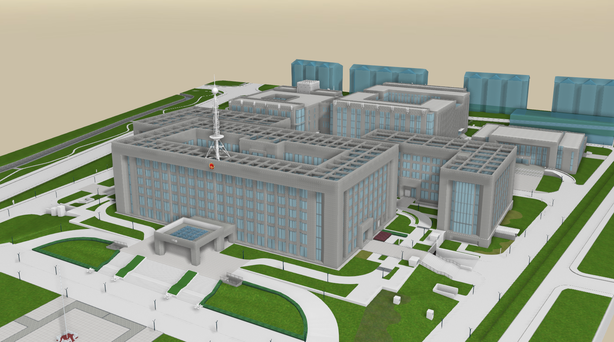
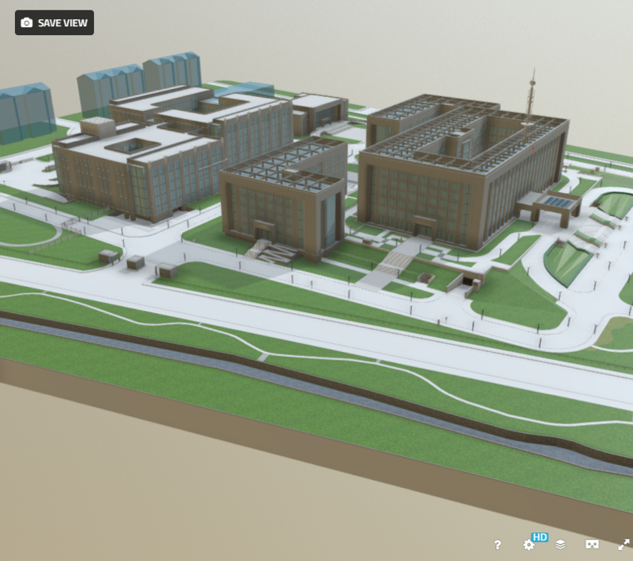

Three And Other
==================

the aim of this project is: create a GLTF Model Renderer based on threejs.

### 项目结构

* res文件夹存放资源文件。
* three文件夹来存放three.js的示例。(js/custom文件夹存放自定义的three相关类)
* 其它示例如OSG.js可以存放在单独的OSG文件夹中。

### 经验

为了达到比较好渲染效果，需要用到以下几个功能：

* 结合场景光照，利用three.js的功能预烘培阴影贴图。
* 动态烘培ao贴图。
* 采用一种抗锯齿方案(SSAA/SMAA/FXAA)。
* 设置renderer的setPixelRatio属性，保证在retina屏幕上的分辨率。（同时，高分辨率有一定的抗锯齿效果。）
* 自定义相机控制器。针对静态场景，监听相机是否运动：运动时，调低一些画面配置（分辨率，抗锯齿等）；场景不运动时，停止重复渲染。
* 某些特殊的场景可能需要配置bloom pass得到比较好的渲染效果。
* 某些场景使用DOF（Depth of Field）pass。

### 结果对比

（注意：res/uinv 下的资源文件由于太大忽略了，如果测试请手动添加测试资源！！！）

three.js:

功能：FXAA && SSAO && SHADOW

sketchfab:

### 待解决

* taa 缺少unbiased修正？ bug。
* three提供的 sao/ssao shader 会导致整体色调变暗，且性能极差。单纯依靠调整参数可能无法达到与OSG相同的效果，需要参考OSG的sao实现。（应该寻找一种可以静态烘培ao贴图的处理方案。）
* 添加Bloom效果
* 添加DOF效果
